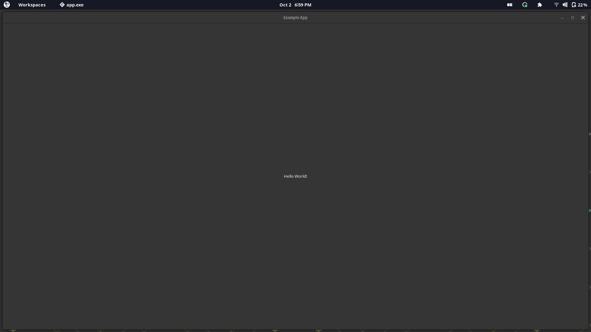
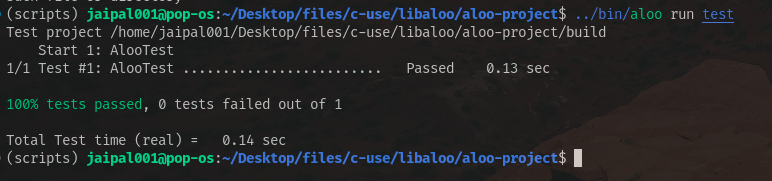

# Aloo

## example

### Sample App

<!-- markdownlint-disable MD010 -->


```c
#include "aloo.h"
#include "common/app.h"
AlooApplication *app;

static void activate() {
	AlooWidget *label = Label.new("Hello World!");
	AlooWidget *win = Window.new(app);
	Window.setChild(win, label);
	Window.setSize(win, 400, 300);
	Window.setTitle(win, "Example App");
	Window.show(win);
	Window.present(win);
	Window.set_app_window(win, app);
}

int main(int argc, char *argv[]) {
	struct AlooAppOptions opts = getAppFlags.none(argc, argv);
	app = Application.create("com.aloo-use.aloo-project", opts);
	Application.add_event_listener(app, "activate", activate);
	int status = Application.run(app);
	Application.unref(app);
	return 0;
}
```

### Sample Test



```c
#include "aloo.h"
#include <stdio.h>
AlooApplication *app;
Test *t;

static void activate() {
	AlooWidget *label = Label.new("Hello World!");
	AlooWidget *win = Window.new(app);
	Window.set.child(win, label);
	Window.set.size(win, 400, 300);
	Window.set.title(win, "Example App");
	Window.show(win);
	Window.present(win);

	t->addTest("Widget Test", t, t->expectGtkWidget(label->child, label));
	t->result(t);

	Window.set.AppWindow(win, app);
	g_application_quit(G_APPLICATION(app->app));
}

int main(int argc, char **argv) {
	t = createTest("Testing");
	t->addTest("Test trying", t, t->expectInt(2 * 2, 4));

	struct AlooAppOptions opts = getAppFlags.none(argc, argv);
	app = Application.create("com.aloo-test.aloo-project", opts);
	Application.add_event_listener(app, "activate", activate, app);

	int status = Application.run(app);
	Application.unref(app);
	return 0;
}
```

## Info

- It is a library I made on top of GTK 4
- To try example, run run.sh in examples with

```bash
cd aloo-edit
aloo build
aloo run app
```

## Install

To install it run

```bash
python3 setup.py  # or use python to setup the aloo cli
./dist/install.sh
```

## Uninstall

```bash
./uninstall.sh
```

## Docs

> Open [docs](docs/index.md) for docs

### lua TUI requirements

```bash
sudo apt install python3.10-venv
```
